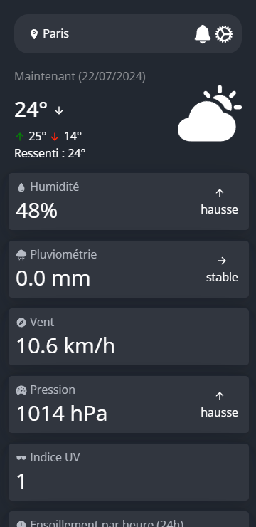
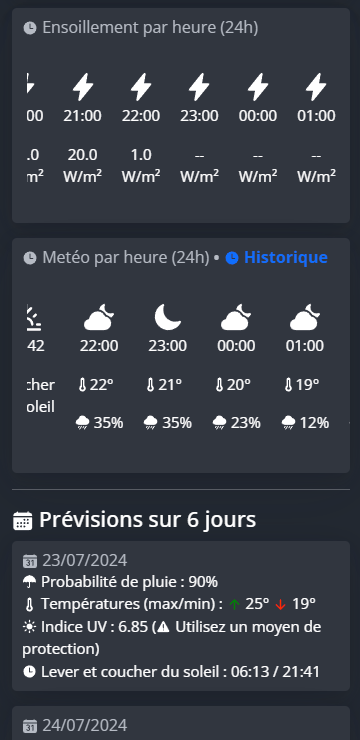
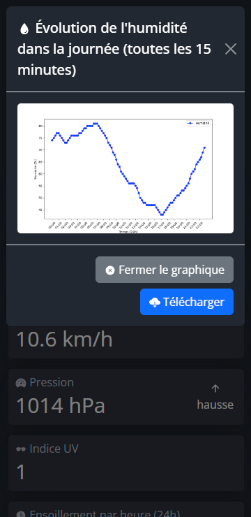
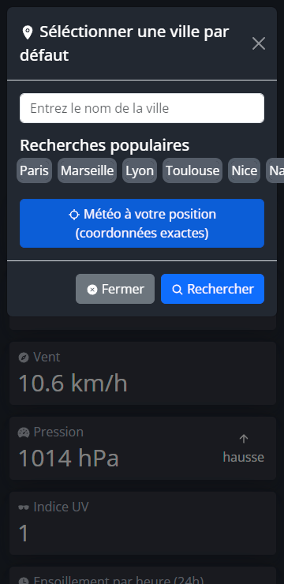

<div align="center">


# Wezzer 


)

[](https://buymeacoffee.com/Albatros329)
[](https://Albatros329.github.io/Wezzer)


</div>

Wezzer est une application web utilisant l'API de [open-meteo](https://open-meteo.com/) pour vous fournir la météo en temps réel ainsi que les prévisions. Cette application est conçue pour être utilisée sur les ordinateurs et les téléphones, offrant une expérience utilisateur fluide et intuitive.

Pour bien débuter, nous vous recommandons de lire la [documentation](https://Albatros329.github.io/Wezzer/).

### [Site de démonstration](https://wezzer.albatros.ovh)

### Compatiblité des navigateurs
| Navigateur         | Statut           |
| ---| --- |
|  Google Chrome ([et navigateurs dérivés](https://fr.wikipedia.org/wiki/Chromium#Autres_navigateurs_fond%C3%A9s_sur_Chromium))   | ✅ Supporté |
|  Mozilla Firefox   | ✅ Supporté (voir __*__) |
|  Safari            | ✅ Supporté |
|  Microsoft Edge    | ✅ Supporté |

__*__: Sur Firefox, Wezzer peut présenter dans certains cas des problèmes d'affichage.

## Fonctionnalités

- **🔒 Sécurité renforcée** : Aucune donnée n'est récupérée sur le serveur hébergeant l'instance. Seuls vos paramètres sont sauvegardés, mais **uniquement** dans les cookies de votre navigateur.
- **💻 Auto-hébergement** : Si vous préférez ne pas utiliser notre instance officielle ou souhaitez proposer votre propre version à vos utilisateurs, vous pouvez **créer votre propre instance** en suivant nos instructions d'installation.
- **📣 Sans publicité ni traqueur** : Wezzer est un projet à but non lucratif dont l'objectif est de fournir un accès simple et sans perturbation à la météo. Vous pouvez néanmoins soutenir le développement en faisant un don du montant de votre choix.
- **🎨 Personnalisable** : Pour rendre votre instance unique, vous avez la possibilité de la personnaliser en modifiant les templates HTML et les fichiers CSS, par exemple.

[**_➔_** Découvrez toutes les fonctionnalitées disponibles sur cette page](https://Albatros329.github.io/Wezzer/#fonctionnalitees)

## Aperçus

<div align="center">






</div>

## Installation

### Via Docker (recommandé)

```
docker pull Albatros329/wezzer
```

```
docker run -p 8080:8080 Albatros329/wezzer
```

Votre application devrait être disponible sur l'adresse [localhost:8080](http://localhost:8080). Pour plus de détails, veuillez lire [la documentation](https://Albatros329.github.io/Wezzer/install/#installation-et-utilisation).

### Autres méthodes

> [!IMPORTANT]  
> Le guide d'installation complet a été déplacé sur [cette page](https://Albatros329.github.io/Wezzer/install/#installation-et-utilisation) dans notre documentation.

## Licence

<p>Ce projet est sous licence  (MIT)</p>


<details>
<summary>Permissions</summary>

- **Usage commercial** : Vous pouvez utiliser ce projet à des fins commerciales.
    - *Exemple* : Intégrer ce projet dans une application que vous vendez.

- **Modification** : Vous êtes autorisé à modifier ce projet.
    - *Exemple* : Ajouter de nouvelles fonctionnalités ou changer le code existant.

- **Distribution** : Vous pouvez distribuer des copies de ce projet.
    - *Exemple* : Partager ce projet avec d'autres développeurs ou inclure le code dans un autre projet.

- **Usage privé** : Vous pouvez utiliser ce projet à titre privé.
    - *Exemple* : Utiliser ce projet pour un projet personnel ou un hobby.

### Limitations

- **Responsabilité** : Le projet est fourni sans aucune garantie. Nous ne sommes pas responsables des dommages ou problèmes résultant de l'utilisation de ce projet.
  - *Exemple* : Si vous utilisez ce projet et qu'il cause des problèmes dans votre système, nous ne pouvons pas être tenus responsables.

- **Garantie** : Aucune garantie n'est fournie avec ce projet. Utilisez-le à vos propres risques.
  - *Exemple* : Si quelque chose ne fonctionne pas comme prévu, il n'y a pas de garantie que cela sera corrigé.

### Conditions

- **Préservation de l'avis de droit d'auteur et de la notice de licence** : Vous devez conserver les mentions de copyright et les avis de licence dans toutes les copies ou parties substantielles du projet.
  - *Exemple* : Si vous distribuez le projet, assurez-vous que le fichier de licence MIT est inclus.

</details>
